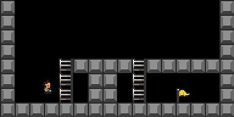

# PyVGDL

A reimplementation on steroids
of the original
[py-vgdl](https://github.com/schaul/py-vgdl/)
by Tom Schaul.

Under heavy and active development,
just check the latest timestamps in the git history.


## What is it?

VGDL stands for
Video Game Description Language.
PyVGDL is an easily scriptable video game engine written in Python,
ideal for artificial intelligence research.

Given a [game description](examples/continuousphysics/platformer.txt),
it allows you to turn something like
```
w              w
w              w
w              w
w              w
w   HwwwwHwwwwww
w   H ww H     w
wA  H ww H  G  w
wwwwwwwwwwwwwwww
```
… into a human or AI-playable game:



PyVGDL aims to be an engine first,
interfacing with
different frameworks
such as OpenAI Gym ([gym_vgdl](https://github.com/EndingCredits/gym_vgdl))
and [pybrain](vgdl/interfaces/pybrain.py).


## Installation
The easiest way to install VGDL as a library
with all its dependencies
is to run
```bash
pip install 'git+https://github.com/rubenvereecken/py-vgdl/#egg=vgdl[all]'
```
Alternatively,
if you know you will only be using
the PyBrain or OpenAI Gym interface,
run one of these
to get just the necessary dependencies.
```bash
# Gym
pip install 'git+https://github.com/rubenvereecken/py-vgdl/#egg=vgdl[gym]'
# PyBrain
pip install 'git+https://github.com/rubenvereecken/py-vgdl/#egg=vgdl[pybrain]'
```

The recommended way to install it if you want to play around
with examples is through a local installation.
```bash
git clone https://github.com/rubenvereecken/py-vgdl
pip install -e 'py-vgdl[all]'
```

### Dependencies
You'll need Python >= 3.6.
This is so we can have nice things.


## How do I use it?

PyVGDL is excellent for designing your own problem environments
that still share some standard characteristics.
It supports grid phyics and
continuous phyics.

You probably want to use
one of several standard interfaces:
- [OpenAI Gym interface](vgdl/interfaces/gym)
- [PyBrain interface](vgdl/interfaces/pybrain)

Read ahead to figure out how best to get started with either.

## Getting Started

Example code is included that relies on VGDL's Gym interface
to demonstrate the engine through human game play.
Give it a go:
```bash
# Any of the games in vgdl/games will work
python -m examples.humanplay.play_vgdl vgdl/games/aliens_lvl0.txt
```
Definitely check out
[all the other examples](examples/README.md)
demonstrating human play (with recording and replay),
reinforcement learning, planning,
and of course writing your own games to do any number of these things.


## How does it relate to other frameworks

- A more full-fledged VGDL implementation is written and maintained
for the [General Video Game AI Competition](http://www.gvgai.net/),
so look there for more features and expressability.
It features a server-client model written in Java,
tailored for the competition,
whereas this repository
aims to be a complete yet lightweight
Python implementation
for AI research.
